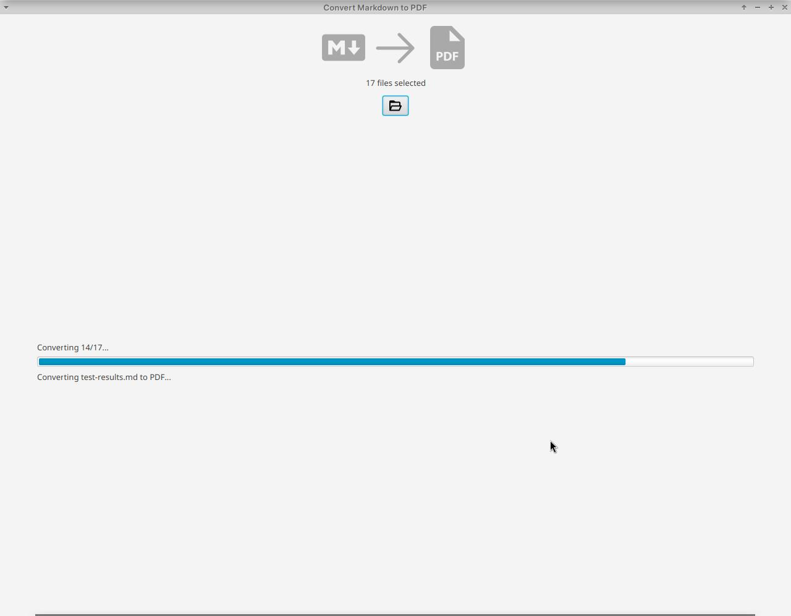

# Markdown to PDF Converter 

JavaFX application that lets you convert Markdown files to clean PDFs.



## How to use

Click that `Select Files` button and pick the markdown files you want to turn into PDFs. You can even choose multiple files (bonus!)

## What to Expect

- A clear progress bar shows you how things are going.
- Informative messages tell you what's happening.
- At the end, you'll have beautiful PDFs ready to go!

## Try it out

Extract the `zip` file in the [releases](https://github.com/IdelsTak/converter-markdown-pdf/releases) section. Then run the jar file, named for instance, `md-to-pdf-1.0-SNAPSHOT.jar`:

```sh
java -jar md-to-pdf-1.0-SNAPSHOT.jar
```

